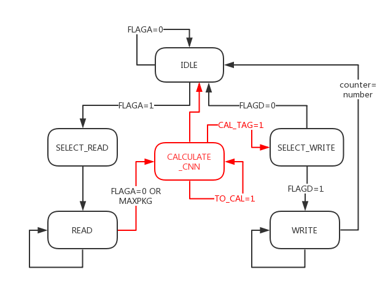
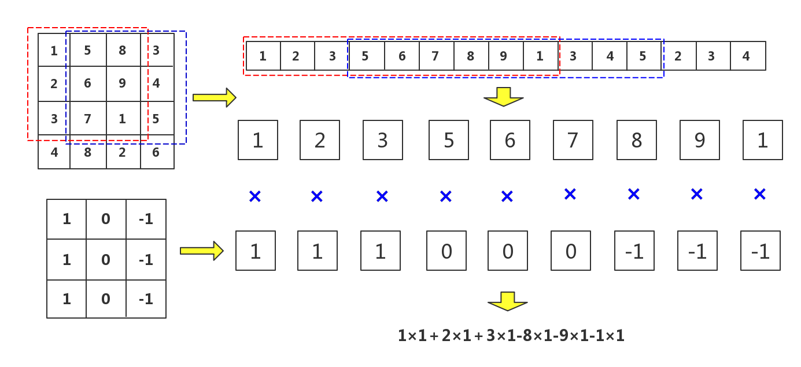
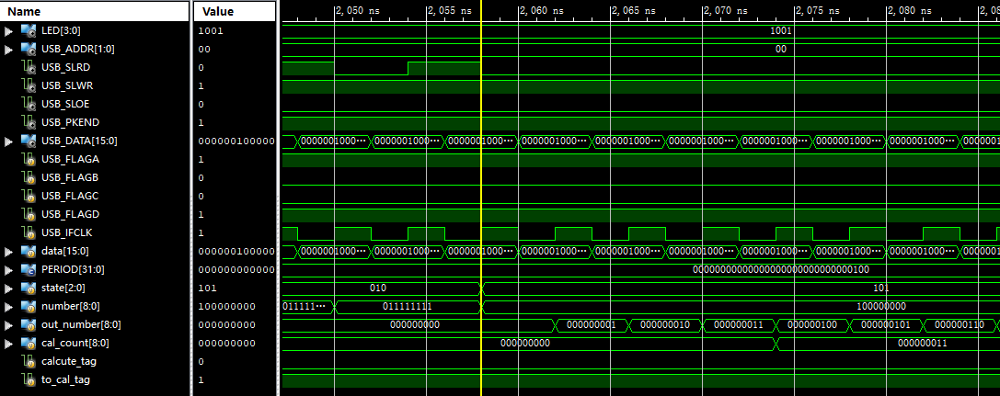
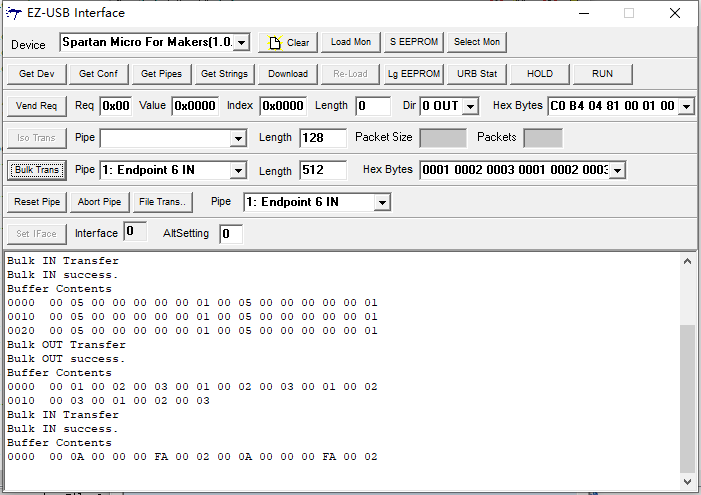

# CNNinFPGA
Implement  convolution kernel in FPGA
在FPGA上实现一个卷积层，包含四个卷积核，编程语言为Verilog。

主要分为两个部分：
 * 实现USB控制器，使用USB驱动在FPGA存取数据
 * 实现卷积核，USB读取数据，在FPGA上计算完成后输出数据

## 1. 状态机介绍
 
在从USB读取完数据之后，FLAGA被置为0代表读取结束，系统直接进入CALCULATECNN，也就是进行卷积操作的状态。 
在卷积操作状态下，如果没有计算完成则继续进行移位和卷积操作，当读入的所有数据的卷积值都被计算完成，CAL_TAG被置为1，系统退出CALCULATE_CNN状态，进入SELECT_WRITE状态执行输出操作。 

## 2. 卷积操作流程
 
由于硬件设备限制，每一段数据都要经过四轮循环才能完成所有卷积核的计算。每一轮开始时通过itr变量判断当前计算处于哪一轮，当前卷积核计算完毕后itr被加一，直到所有卷积核都被计算，itr恢复为0，数据偏移量要加上3，从而获取下一轮的9个数据进行计算。 

## 3. 仿真
仿真文件见fpga_tb.v 
 

## 4. CyPress Suite USB验证
 
记0001为一个数字，如果输入了n个数字，那个输出数字的数量N=4n/3-8。

